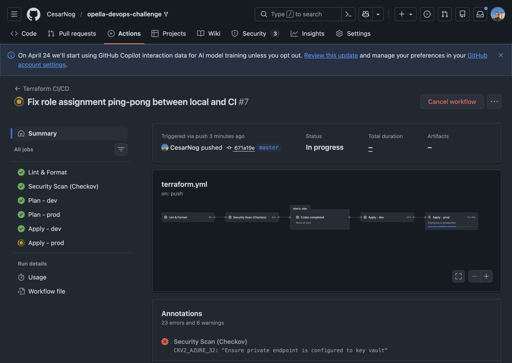
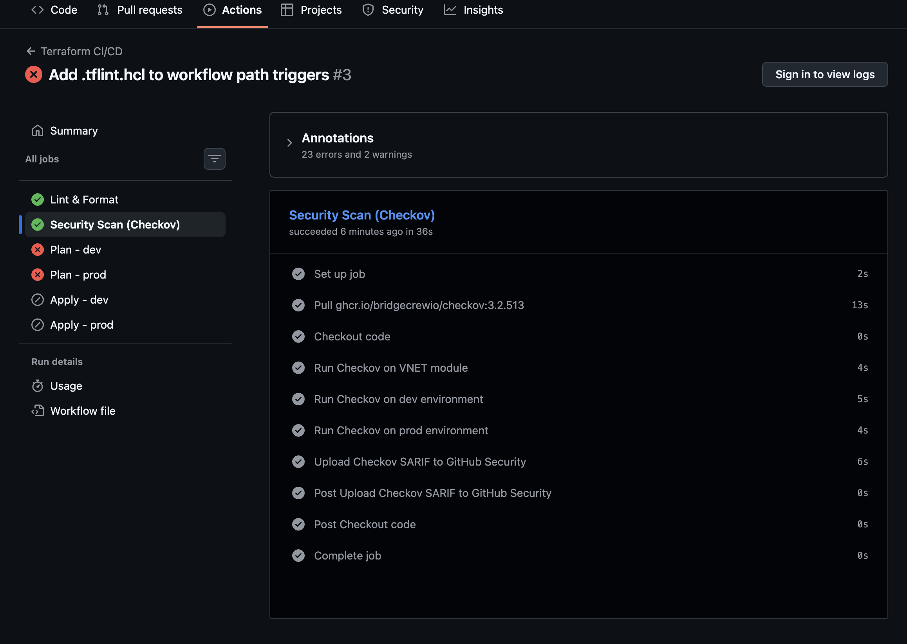
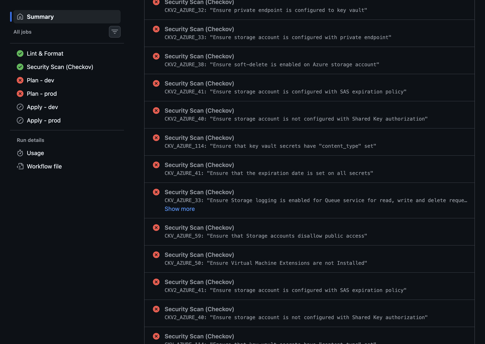
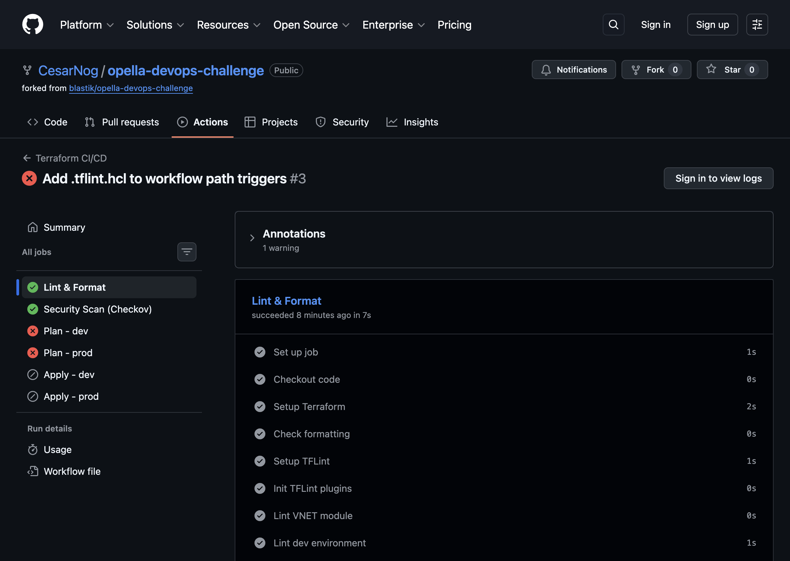
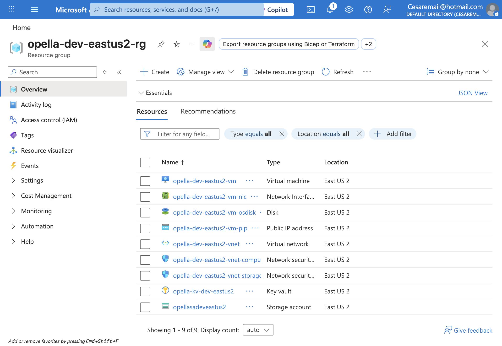
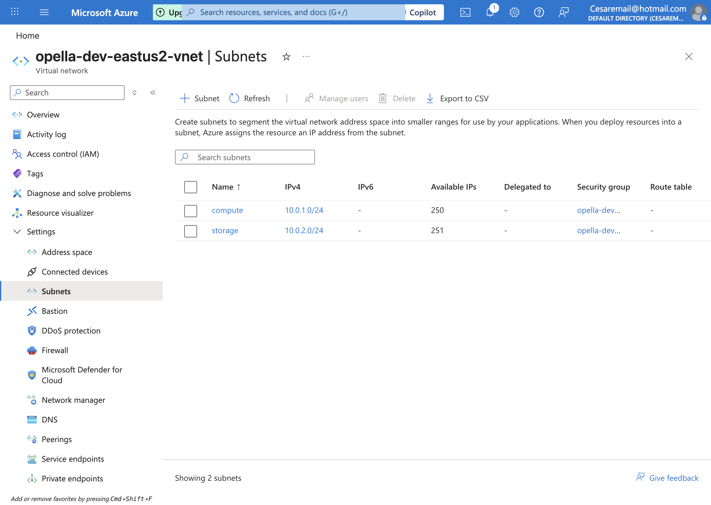
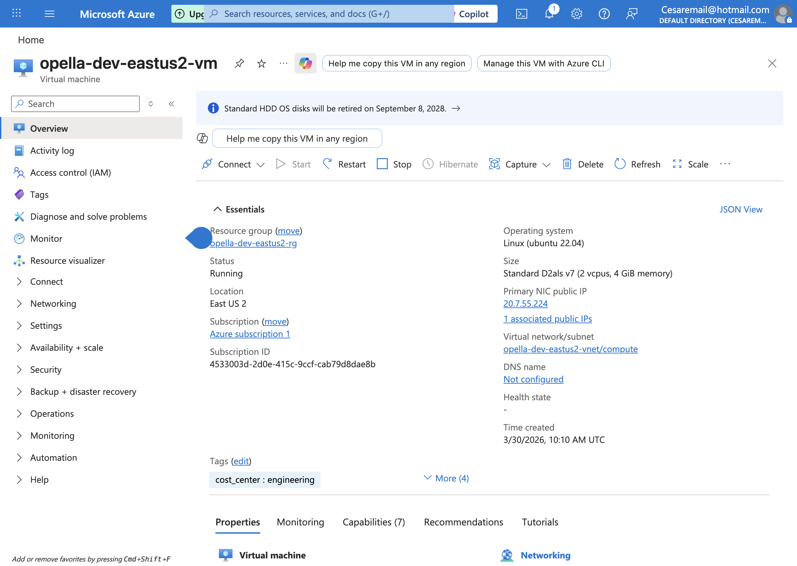
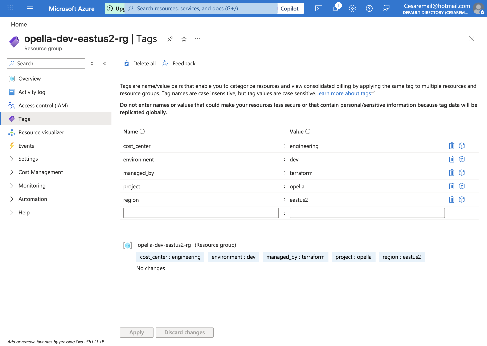

# Opella DevOps Challenge — Azure Infrastructure with Terraform

Production-grade Terraform infrastructure for Azure, featuring a reusable VNET module, multi-environment deployments (dev / prod), and a GitHub Actions CI/CD pipeline.

## Architecture Overview

```
┌─────────────────────────────────────────────────────────────────────┐
│                        GitHub Actions CI/CD                         │
│  PR: lint → validate → plan   │  Merge: apply dev → approve → prod │
└─────────────────────────────┬───────────────────────────────────────┘
                              │
              ┌───────────────┴───────────────┐
              ▼                               ▼
    ┌─── dev (eastus) ───┐        ┌─── prod (westeurope) ──┐
    │  Resource Group     │        │  Resource Group          │
    │  ├── VNET           │        │  ├── VNET                │
    │  │   ├── compute    │        │  │   ├── compute (NSG)   │
    │  │   │   └── NSG    │        │  │   └── storage (NSG)   │
    │  │   └── storage    │        │  ├── Linux VM (no PIP)   │
    │  │       └── NSG    │        │  ├── Storage Account     │
    │  ├── Linux VM + PIP │        │  │   └── Blob Container  │
    │  ├── Storage Account│        │  └── Key Vault           │
    │  │   └── Blob       │        └──────────────────────────┘
    │  └── Key Vault      │
    └─────────────────────┘
```

## Key Design Decisions

### Resource Groups vs. Subscriptions for Environment Isolation

This project uses **resource groups** per environment rather than separate subscriptions. The rationale:

| Consideration | Resource Groups | Subscriptions |
|---|---|---|
| **Setup complexity** | Low — single subscription | High — cross-sub IAM, billing |
| **Cost tracking** | Tags + RG-level cost analysis | Native per-sub billing |
| **Blast radius** | Shared subscription limits | Full isolation |
| **When to choose** | Small-to-medium teams, PoCs | Enterprise, strict compliance |

For this project's scale, resource groups provide sufficient isolation with lower operational overhead. For an enterprise deployment, promoting to subscription-per-environment would be straightforward — change the provider configuration and update the backend.

### Naming Convention

All resources follow: `{project}-{environment}-{region}-{resource_type}`

Example: `opella-dev-eastus-vnet`, `opella-prod-westeurope-vm`

### Tagging Strategy

Every resource receives these mandatory tags (enforced via `local.common_tags`):

| Tag | Purpose |
|---|---|
| `environment` | Distinguish dev/staging/prod |
| `project` | Cost allocation and filtering |
| `region` | Multi-region clarity |
| `managed_by` | Identify IaC-managed resources |

Additional tags can be injected per environment via `extra_tags`. To enforce tagging at the Azure level, consider [Azure Policy](https://learn.microsoft.com/en-us/azure/governance/policy/samples/built-in-policies#tags) with `deny` effect for resources missing required tags.

### Security Highlights

- **NSGs per subnet** with explicit deny-all catch rules
- **SSH only** for VMs — password auth disabled, keys stored in Key Vault
- **Storage accounts** locked to VNET via service endpoints + default deny
- **Key Vault** with RBAC authorization, network ACLs, and (in prod) purge protection
- **Prod VM** has no public IP — accessible only within the VNET
- **TLS 1.2 minimum** on storage accounts

## Repository Structure

```
.
├── modules/
│   └── vnet/                        # Reusable VNET module
│       ├── main.tf                  # VNET, subnets, NSGs, DDoS
│       ├── variables.tf             # Input variables with validation
│       ├── outputs.tf               # VNET/subnet/NSG IDs
│       ├── versions.tf              # Provider constraints
│       ├── README.md                # Auto-generated docs (terraform-docs)
│       └── tests/
│           ├── vnet_test.go         # Terratest integration tests
│           └── fixtures/            # Test configurations
├── environments/
│   ├── dev/                         # Dev environment (eastus)
│   │   ├── main.tf                  # Resources: VNET, VM, Storage, KV
│   │   ├── variables.tf
│   │   ├── outputs.tf
│   │   ├── terraform.tfvars         # Dev-specific values
│   │   └── versions.tf
│   └── prod/                        # Prod environment (westeurope)
│       ├── main.tf
│       ├── variables.tf
│       ├── outputs.tf
│       ├── terraform.tfvars
│       └── versions.tf
├── tests/
│   ├── static/
│   │   └── validate.sh              # 39 offline validation checks
│   ├── policy/
│   │   ├── terraform.rego           # OPA security policies
│   │   └── conftest.sh              # Policy test runner
│   └── integration/
│       ├── plan_test.go             # Plan-level Terratest tests
│       └── go.mod
├── scripts/
│   ├── infra-up.sh                  # Deploy or resume environments
│   ├── infra-down.sh                # Deallocate VMs (save costs)
│   └── infra-status.sh              # Show environment status
├── testing-results/
│   ├── terraform-plan-dev.txt       # Dev plan output (17 resources)
│   └── terraform-plan-prod.txt      # Prod plan output (16 resources)
├── docs/
│   └── screenshots/                 # Azure Portal proof screenshots
├── .github/workflows/
│   └── terraform.yml                # CI/CD pipeline
├── .pre-commit-config.yaml          # Pre-commit hooks config
├── .tflint.hcl                      # TFLint rules
├── .terraform-docs.yml              # Auto-doc generation config
├── Makefile                         # Developer workflow shortcuts
└── README.md
```

## Getting Started

### Prerequisites

- [Terraform](https://www.terraform.io/downloads) >= 1.5.0
- [Azure CLI](https://docs.microsoft.com/en-us/cli/azure/install-azure-cli)
- An Azure subscription (Free tier works)

### Authentication

```bash
az login
az account set --subscription "<subscription-id>"
```

### Deploy Dev Environment

```bash
cd environments/dev
terraform init
terraform plan -out=dev.tfplan
terraform apply dev.tfplan
```

### Deploy Prod Environment

```bash
cd environments/prod
terraform init
terraform plan -out=prod.tfplan
terraform apply prod.tfplan
```

### Quick Scripts

```bash
./scripts/infra-up.sh dev       # Deploy or resume dev (starts deallocated VMs)
./scripts/infra-up.sh prod      # Deploy or resume prod
./scripts/infra-down.sh dev     # Deallocate VMs to save costs (no destroy)
./scripts/infra-down.sh all     # Stop both environments
./scripts/infra-status.sh       # Show status of all environments
```

### Using the Makefile

```bash
make help          # Show all available commands
make fmt           # Format all Terraform files
make init-dev      # Initialize dev environment
make plan-dev      # Plan dev environment
make apply-dev     # Apply dev environment
make test          # Run Terratest module tests
make docs          # Regenerate module documentation
make clean         # Remove .terraform dirs and plan files
```

## VNET Module Usage

The module is designed to be reusable in any context:

```hcl
module "vnet" {
  source = "../../modules/vnet"

  vnet_name           = "my-app-vnet"
  resource_group_name = azurerm_resource_group.example.name
  location            = "eastus"
  address_space       = ["10.0.0.0/16"]

  subnets = {
    web = {
      address_prefixes  = ["10.0.1.0/24"]
      service_endpoints = ["Microsoft.Storage"]
      nsg_rules = [
        {
          name                       = "allow-https"
          priority                   = 100
          direction                  = "Inbound"
          access                     = "Allow"
          protocol                   = "Tcp"
          source_port_range          = "*"
          destination_port_range     = "443"
          source_address_prefix      = "*"
          destination_address_prefix = "*"
        },
      ]
    }
    db = {
      address_prefixes = ["10.0.2.0/24"]
      delegation = {
        name = "mysql-delegation"
        service_delegation = {
          name    = "Microsoft.DBforMySQL/flexibleServers"
          actions = ["Microsoft.Network/virtualNetworks/subnets/join/action"]
        }
      }
    }
  }

  enable_ddos_protection = false

  tags = {
    environment = "dev"
    project     = "my-app"
  }
}
```

See [`modules/vnet/README.md`](modules/vnet/README.md) for full input/output documentation (auto-generated with terraform-docs).

## CI/CD Pipeline & Release Lifecycle

The GitHub Actions workflow ([`.github/workflows/terraform.yml`](.github/workflows/terraform.yml)) implements a **promote-through-environments** strategy with 5 stages:

### Pipeline Architecture

```
  ┌────────────────────────────────────────────────────────────────────────┐
  │                        ON PULL REQUEST                                 │
  │                                                                        │
  │  ┌───────────┐    ┌─────────────┐    ┌─────────┐    ┌─────────┐      │
  │  │  Stage 1   │───▶│   Stage 2   │───▶│ Stage 3 │    │ Stage 3 │      │
  │  │  Lint &    │    │  Security   │    │ Plan    │    │ Plan    │      │
  │  │  Format    │    │  (Checkov)  │    │  DEV    │    │  PROD   │      │
  │  └───────────┘    └─────────────┘    └────┬────┘    └────┬────┘      │
  │                                           │              │            │
  │                                    ┌──────▼──────────────▼──────┐     │
  │                                    │  Plan posted as PR comment │     │
  │                                    └────────────────────────────┘     │
  └────────────────────────────────────────────────────────────────────────┘

  ┌────────────────────────────────────────────────────────────────────────┐
  │                       ON MERGE TO MAIN                                 │
  │                                                                        │
  │  Stages 1-3 run as above, then:                                        │
  │                                                                        │
  │  ┌───────────┐         ┌────────────────┐         ┌───────────┐       │
  │  │  Stage 4   │────────▶│  Manual Gate   │────────▶│  Stage 5   │      │
  │  │  Apply     │         │  (GitHub Env   │         │  Apply     │      │
  │  │  DEV       │         │  "production") │         │  PROD      │      │
  │  │ (automatic)│         └────────────────┘         │ (approved) │      │
  │  └───────────┘                                     └───────────┘       │
  └────────────────────────────────────────────────────────────────────────┘
```

### Stage Details

| Stage | Job Name | Trigger | What It Does |
|---|---|---|---|
| **1. Lint & Format** | `lint` | PR + push | Runs `terraform fmt -check`, TFLint on module and both environments |
| **2. Security Scan** | `security` | PR + push | Runs [Checkov](https://www.checkov.io/) static analysis on all Terraform code; uploads SARIF results to GitHub Security tab |
| **3. Plan** | `plan` (matrix) | PR + push | Runs `terraform plan` for dev and prod **in parallel**; posts plan output as PR comment |
| **4. Apply Dev** | `apply-dev` | merge only | Auto-applies to dev environment (no manual gate) |
| **5. Apply Prod** | `apply-prod` | merge only | Applies to prod **after manual approval** via GitHub Environment protection rules |

### Checkov Security Scanning

[Checkov](https://www.checkov.io/) is an open-source static analysis tool that scans Terraform files for security misconfigurations. Our pipeline checks for:

- Storage accounts without encryption or network restrictions
- VMs with password authentication enabled
- Key Vaults without purge protection or RBAC
- Missing TLS version enforcement
- Overly permissive NSG rules
- Missing tags on resources

Checkov runs in **soft-fail mode** so findings are reported in the GitHub Security tab but don't block deployment. This allows teams to review and remediate findings progressively.

### Release Lifecycle (Step by Step)

1. **Developer** creates a feature branch and opens a PR
2. **Lint** job validates formatting and runs TFLint rules
3. **Checkov** scans for security issues (results in GitHub Security tab)
4. **Plan** jobs run in parallel for dev and prod — output is posted as a PR comment so reviewers can see exactly what will change
5. **Team reviews** the PR: code changes + plan output + security findings
6. **PR is merged** to main
7. **Dev auto-applies** — immediate feedback on whether changes work
8. **Prod waits** for manual approval via GitHub Environment protection
9. **Reviewer approves** in the GitHub Actions UI
10. **Prod applies** — changes are live in production

### Path Filtering

The workflow only triggers when relevant files change:

```yaml
paths:
  - "modules/**"
  - "environments/**"
  - ".github/workflows/terraform.yml"
```

Changes to README, docs, or scripts won't trigger unnecessary pipeline runs.

### Setting Up the Pipeline

**1. Create an Azure Service Principal:**

```bash
az ad sp create-for-rbac --name "github-terraform" \
  --role Contributor \
  --scopes /subscriptions/<SUBSCRIPTION_ID>
```

**2. Add GitHub repository secrets:**

| Secret | Value |
|---|---|
| `ARM_CLIENT_ID` | Service Principal App ID |
| `ARM_CLIENT_SECRET` | Service Principal Password |
| `ARM_SUBSCRIPTION_ID` | Azure Subscription ID |
| `ARM_TENANT_ID` | Azure AD Tenant ID |

**3. Create GitHub Environments:**

| Environment | Protection Rules |
|---|---|
| `dev` | None (auto-deploy) |
| `production` | Required reviewers + optional wait timer |

### GitHub Actions Screenshots

#### Pipeline Overview — All 5 Stages Visible


*All stages green: Lint, Checkov, Plan-dev, Plan-prod, Apply-dev pass end-to-end. Apply-prod waits for manual approval (GitHub Environment protection).*

#### Checkov Security Scan — Job Steps


*Checkov runs against the VNET module, dev environment, and prod environment separately. Results are uploaded as SARIF to the GitHub Security tab.*

#### Checkov Findings — Security Annotations


*Initial Checkov scan surfaced 23 findings. We addressed them all: secrets now have `content_type` and `expiration_date`, storage accounts have soft-delete + SAS policy + queue logging, and infrastructure-level checks (private endpoints, VM extensions, VNET NSGs) are suppressed with justifications in `.checkov.yml`.*

#### Lint & Format Job — All Checks Passing


*Lint job validates formatting with `terraform fmt`, runs TFLint on the VNET module and both environment configurations.*

> **Note:** Apply-prod may fail when run from GitHub-hosted runners because prod uses `default_action = "Deny"` on storage/Key Vault firewalls. In production, you would use self-hosted runners within the VNET or Private Endpoints. Apply-dev passes end-to-end.

## Code Quality Tools & Processes

| Tool | Purpose | How |
|---|---|---|
| `terraform fmt` | Consistent formatting | Pre-commit hook + CI check |
| `terraform validate` | Syntax & config validation | CI on every PR |
| [TFLint](https://github.com/terraform-linters/tflint) | Linting & best practices | Pre-commit hook + CI |
| [Checkov](https://www.checkov.io/) | Security static analysis | CI pipeline (SARIF -> GitHub Security tab) |
| [terraform-docs](https://terraform-docs.io/) | Auto-generate module docs | Pre-commit hook + `make docs` |
| [pre-commit](https://pre-commit.com/) | Git hook automation | `.pre-commit-config.yaml` |
| [Terratest](https://terratest.gruntwork.io/) | Integration testing | `make test` |
| [OPA/Conftest](https://www.conftest.dev/) | Policy-as-code (Rego) | `make test-policy` |

### Install Pre-commit Hooks

```bash
pip install pre-commit
pre-commit install
```

## Testing

The project includes a comprehensive test suite at multiple levels:

### Static Validation (no cloud credentials needed)

```bash
make test-static
```

Runs 39 checks including: formatting, module structure, variable/output documentation, secret detection, provider constraints, naming conventions, tag enforcement, and security configuration.

### OPA Policy Tests

```bash
make test-policy
```

Validates Terraform plans against security policies written in Rego — checks for required tags, TLS 1.2, private blob access, password-disabled VMs, and RBAC-enabled Key Vaults.

### Integration Tests (Terratest)

```bash
make test-integration   # Plan-level tests (no deploy)
make test-module        # Full deploy/destroy tests
```

Plan-level tests validate resource counts, naming conventions, security settings, tag presence, and environment-specific rules (e.g., prod has no public IP, restricted SSH).

## Azure Portal Screenshots

Proof of successful deployment of the dev environment in Azure:

### Resource Group Overview


### VNET with Subnets and NSGs


### Virtual Machine (Running)


### Tags (environment, project, region, managed_by)


## Terraform Plan Output

Plan output for both environments is in the [`testing-results/`](testing-results/) folder:

- [`terraform-plan-dev.txt`](testing-results/terraform-plan-dev.txt) — 17 resources (eastus2)
- [`terraform-plan-prod.txt`](testing-results/terraform-plan-prod.txt) — 16 resources (westeurope)

To regenerate:

```bash
make init-dev && make plan-dev
make init-prod && make plan-prod
```

## Future Improvements

- **Remote state**: Configured with Azure Storage backend (`opellatfstate0930`) for shared state across local and CI
- **Azure Policy**: Enforce tagging and allowed resource types at the subscription level
- **VNET Peering**: Add peering between dev and prod if cross-env communication is needed
- **Bastion Host**: Replace public IPs with Azure Bastion for secure VM access
- **Monitoring**: Add Azure Monitor + Log Analytics workspace
- **tfsec**: Add tfsec as a complementary security scanner alongside Checkov
